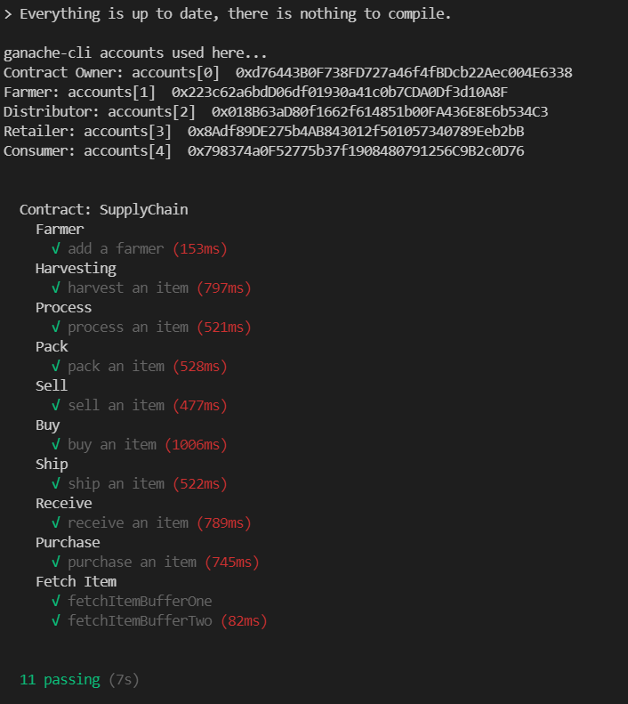

# Ethereum DApp for Tracking Items through Supply Chain

# Introduction

This project consists in a decentralized application (DApp) of a supply chain solution backed by the Ethereum platform.

**Important**: The project was made with the versions below:

- Truffle v5.4.0 (core: 5.4.0)
- Solidity - 0.8.3 (solc-js)

**Important**: The project didn't use any external **libraries** worth mentioning and also didn't use **IPFS** to host the frontend part decentralized as well.

# UML


### Getting Started

1. Clone this repository.
2. Install the dependencies with [NodeJS](https://nodejs.org/en/) and NPM.
3. Test the application making calls to the contract on the [Rinkeby Test Network](https://rinkeby.etherscan.io/).
4. Take a look at the transactions happening on the Rinkeby Test Network at [Etherscan](https://rinkeby.etherscan.io/) explorer.


**Important**: You will need your personal passphrase from your Ethereum account to publish into the Rinkeby Test Network, hence the **.secret** file in the **truffle-config.js**, even tough being a test network.

### Instructions

1. Install the dependencies:

```powershell
  npm i
```

2. Turn on the Ganache suite so that you will have pre-defined accounts to test the contracts:


3. Migrate, compile and test the contracts with truffle (on a separate console). It will use the previously up and running ganache locally blockchain.

```powershell
  truffle migrate
  truffle compile
  truffle test
```



4. Publish the contracts into the Rinkeby Test Network with your Infura key:

```powershell
  truffle migrate --reset --network rinkeby
```

5. Check out and test the DApp in the frontend with the command below. You can run on the ganache-cli window, since Ganache was only for testing purpose.

```powershell
  npm run dev
```
### Output

Etherscan info:

- Transaction ID: [**0x9f15ea1856b12533b31e0cd695ae20baa88ab3b0df0cde3c09a6f3501d0ab694 **](https://rinkeby.etherscan.io/tx/0x9f15ea1856b12533b31e0cd695ae20baa88ab3b0df0cde3c09a6f3501d0ab694 )
- Contract: [**0x782d9E8557eb4ccAf63922Db67829861F5Db2Dc2**](https://rinkeby.etherscan.io/address/0x782d9E8557eb4ccAf63922Db67829861F5Db2Dc2)
